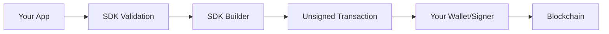

# Architecture

The Omni Bridge SDK uses a **transaction builder pattern**. This design separates the bridge protocol logic from transaction signing, giving you complete control over your key management.

## The Transaction Builder Pattern



The SDK handles:
- ✅ Address validation and normalization
- ✅ Token registration verification
- ✅ Decimal normalization between chains
- ✅ Fee calculation
- ✅ Transaction encoding

You handle:
- ✅ Key management
- ✅ Gas estimation (optional)
- ✅ Transaction signing
- ✅ Broadcasting

## Factory Functions

Each chain has its own builder factory:

| Factory | Package | Chains |
|---------|---------|--------|
| `createBridge()` | `@omni-bridge/core` | All (validation only) |
| `createEvmBuilder()` | `@omni-bridge/evm` | Eth, Base, Arb, Pol, Bnb |
| `createNearBuilder()` | `@omni-bridge/near` | NEAR |
| `createSolanaBuilder()` | `@omni-bridge/solana` | Solana |
| `createBtcBuilder()` | `@omni-bridge/btc` | Bitcoin, Zcash |

```typescript
import { createBridge, ChainKind } from "@omni-bridge/core"
import { createEvmBuilder } from "@omni-bridge/evm"
import { createNearBuilder } from "@omni-bridge/near"

// Create validators and builders
const bridge = createBridge({ network: "mainnet" })
const evmBuilder = createEvmBuilder({ network: "mainnet", chain: ChainKind.Eth })
const nearBuilder = createNearBuilder({ network: "mainnet" })
```

## Unsigned Transaction Types

Each builder returns a library-agnostic transaction object:

<Tabs>
  <Tab title="EVM">
    ```typescript
    interface EvmUnsignedTransaction {
      to: `0x${string}`
      data: `0x${string}`
      value: bigint
      chainId: number
    }
    ```
    
    Works directly with viem and ethers v6:
    ```typescript
    // viem
    await walletClient.sendTransaction(tx)
    
    // ethers
    await signer.sendTransaction(tx)
    ```
  </Tab>
  
  <Tab title="NEAR">
    ```typescript
    interface NearUnsignedTransaction {
      type: "near"
      signerId: string
      receiverId: string
      actions: NearAction[]
    }
    ```
    
    Requires a shim for signing libraries:
    ```typescript
    import { toNearKitTransaction, sendWithNearApiJs } from "@omni-bridge/near"
    
    // near-kit
    await toNearKitTransaction(near, tx).send()
    
    // near-api-js
    await sendWithNearApiJs(account, tx)
    ```
  </Tab>
  
  <Tab title="Solana">
    ```typescript
    // Returns native TransactionInstruction[]
    const instructions = await solana.buildTransfer(validated, payer)
    
    // Add to your transaction
    const tx = new Transaction()
    tx.add(...instructions)
    await sendAndConfirmTransaction(connection, tx, [keypair])
    ```
  </Tab>
  
  <Tab title="Bitcoin">
    ```typescript
    interface BtcWithdrawalPlan {
      inputs: string[]  // "txid:vout" format
      outputs: Array<{ value: number; script_pubkey: string }>
      fee: bigint
    }
    ```
    
    Use with any Bitcoin signing library.
  </Tab>
</Tabs>

## The Three-Step Flow

Every transfer follows the same pattern:

<Steps>
  <Step title="Validate">
    The `bridge.validateTransfer()` method validates your transfer parameters and returns a `ValidatedTransfer` object containing normalized amounts and chain information.

    ```typescript
    const validated = await bridge.validateTransfer({
      token: "eth:0xA0b86991c6218b36c1d19D4a2e9Eb0cE3606eB48",
      amount: 1000000n,
      fee: 0n,
      nativeFee: 0n,
      sender: "eth:0x...",
      recipient: "near:alice.near",
    })
    ```
  </Step>
  
  <Step title="Build">
    Pass the validated transfer to a chain-specific builder to get an unsigned transaction.

    ```typescript
    const tx = evmBuilder.buildTransfer(validated)
    // tx is a plain object: { to, data, value, chainId }
    ```
  </Step>
  
  <Step title="Sign & Send">
    Use your preferred library to sign and broadcast.

    ```typescript
    await walletClient.sendTransaction(tx)
    ```
  </Step>
</Steps>

## Package Structure

The SDK is organized as a monorepo with separate packages for each chain:

```
@omni-bridge/
├── core     → Validation, types, API client
├── evm      → Ethereum, Base, Arbitrum, Polygon, BNB
├── near     → NEAR Protocol
├── solana   → Solana
├── btc      → Bitcoin, Zcash
└── sdk      → Umbrella (re-exports all)
```

Install just what you need:

```bash
# Full SDK
npm install @omni-bridge/sdk

# Just EVM chains
npm install @omni-bridge/core @omni-bridge/evm
```

## Why This Design?

<AccordionGroup>
  <Accordion title="Library agnostic">
    Use viem, ethers, web3.js, or any other library. The SDK doesn't lock you into a specific signing solution.
  </Accordion>
  
  <Accordion title="Wallet flexibility">
    Works with browser wallets, hardware wallets, MPC signers, or your own key management.
  </Accordion>
  
  <Accordion title="Bundle size">
    Import only the chains you need. A viem-based EVM app doesn't need Solana dependencies.
  </Accordion>
  
  <Accordion title="Testing">
    Unsigned transactions are easy to test — just validate the object structure without needing real keys.
  </Accordion>
</AccordionGroup>

## Next Steps

<CardGroup cols={2}>
  <Card title="OmniAddress Format" icon="at" href="/concepts/omni-addresses">
    Learn how cross-chain addresses work
  </Card>
  <Card title="Decimal Normalization" icon="calculator" href="/concepts/decimal-normalization">
    Critical concept for transfers
  </Card>
</CardGroup>
