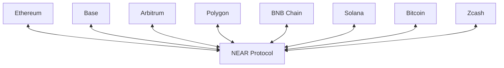

# Supported Chains

The Omni Bridge SDK supports transfers between multiple blockchains.

## Chain Overview

| Chain | Type | ChainKind | Prefix | Mainnet | Testnet |
|-------|------|-----------|--------|---------|---------|
| Ethereum | EVM | `Eth` (0) | `eth:` | ✅ | ✅ (Sepolia) |
| NEAR | Native | `Near` (1) | `near:` | ✅ | ✅ |
| Solana | Native | `Sol` (2) | `sol:` | ✅ | ✅ (Devnet) |
| Arbitrum | EVM L2 | `Arb` (3) | `arb:` | ✅ | ✅ |
| Base | EVM L2 | `Base` (4) | `base:` | ✅ | ✅ |
| BNB Chain | EVM | `Bnb` (5) | `bnb:` | ✅ | ✅ |
| Bitcoin | UTXO | `Btc` (6) | `btc:` | ✅ | ✅ |
| Zcash | UTXO | `Zcash` (7) | `zec:` | ✅ | ✅ |
| Polygon | EVM | `Pol` (8) | `pol:` | ✅ | ✅ |

## EVM Chains

All EVM chains use the same builder with different `ChainKind`:

```typescript
import { createEvmBuilder } from "@omni-bridge/evm"
import { ChainKind } from "@omni-bridge/core"

const ethBuilder = createEvmBuilder({ network: "mainnet", chain: ChainKind.Eth })
const baseBuilder = createEvmBuilder({ network: "mainnet", chain: ChainKind.Base })
const arbBuilder = createEvmBuilder({ network: "mainnet", chain: ChainKind.Arb })
const polBuilder = createEvmBuilder({ network: "mainnet", chain: ChainKind.Pol })
const bnbBuilder = createEvmBuilder({ network: "mainnet", chain: ChainKind.Bnb })
```

### Chain IDs

<Tabs>
  <Tab title="Mainnet">
    | Chain | Chain ID |
    |-------|----------|
    | Ethereum | 1 |
    | Arbitrum | 42161 |
    | Base | 8453 |
    | BNB Chain | 56 |
    | Polygon | 137 |
  </Tab>
  <Tab title="Testnet">
    | Chain | Chain ID |
    |-------|----------|
    | Ethereum (Sepolia) | 11155111 |
    | Arbitrum (Sepolia) | 421614 |
    | Base (Sepolia) | 84532 |
    | BNB Chain | 97 |
    | Polygon (Amoy) | 80002 |
  </Tab>
</Tabs>

## NEAR Protocol

```typescript
import { createNearBuilder } from "@omni-bridge/near"

const nearBuilder = createNearBuilder({ network: "mainnet" })
```

NEAR is the hub of the Omni Bridge. All cross-chain tokens are registered on NEAR, and transfers between non-NEAR chains route through NEAR.

<Note>
  NEAR uses 24-decimal precision for wrapped tokens, ensuring high-precision transfers from any chain.
</Note>

## Solana

```typescript
import { createSolanaBuilder } from "@omni-bridge/solana"
import { Connection } from "@solana/web3.js"

const connection = new Connection("https://api.mainnet-beta.solana.com")
const solanaBuilder = createSolanaBuilder({ 
  network: "mainnet",
  connection  // optional, uses public RPC if not provided
})
```

Solana transfers use the Wormhole bridge for cross-chain messaging.

## Bitcoin & Zcash

```typescript
import { createBtcBuilder } from "@omni-bridge/btc"

const btcBuilder = createBtcBuilder({ network: "mainnet", chain: "btc" })
const zecBuilder = createBtcBuilder({ network: "mainnet", chain: "zcash" })
```

UTXO chains (Bitcoin and Zcash) use a different flow:
- **Deposits**: Generate a deposit address, send funds, then finalize on NEAR
- **Withdrawals**: Initiate on NEAR, MPC signs, broadcast to network

## Transfer Routes

All transfers route through NEAR:



<Note>
  Direct transfers between non-NEAR chains (e.g., Ethereum → Solana) are handled automatically, but internally route through NEAR.
</Note>

## Bridge Contracts

Each chain has a bridge contract deployed:

<Tabs>
  <Tab title="Mainnet">
    | Chain | Contract |
    |-------|----------|
    | Ethereum | `0x...` |
    | Base | `0x...` |
    | Arbitrum | `0x...` |
    | NEAR | `omni-bridge.near` |
    | Solana | `...` |
  </Tab>
  <Tab title="Testnet">
    | Chain | Contract |
    |-------|----------|
    | Ethereum (Sepolia) | `0x...` |
    | Base (Sepolia) | `0x...` |
    | NEAR | `omni-bridge.testnet` |
  </Tab>
</Tabs>

<Tip>
  Use `bridge.addresses` to get the current contract addresses for your network:
  
  ```typescript
  const bridge = createBridge({ network: "mainnet" })
  console.log(bridge.addresses.eth.bridge)  // EVM bridge address
  console.log(bridge.addresses.near.contract)  // NEAR contract
  ```
</Tip>

## Next Steps

<CardGroup cols={2}>
  <Card title="EVM Transfers" icon="ethereum" href="/guides/evm-transfers">
    Transfer from Ethereum, Base, Arbitrum
  </Card>
  <Card title="NEAR Transfers" icon="circle-nodes" href="/guides/near-transfers">
    Transfer from NEAR Protocol
  </Card>
  <Card title="Solana Transfers" icon="sun" href="/guides/solana-transfers">
    Transfer from Solana
  </Card>
  <Card title="Bitcoin Transfers" icon="bitcoin" href="/guides/bitcoin-transfers">
    Bridge Bitcoin and Zcash
  </Card>
</CardGroup>
