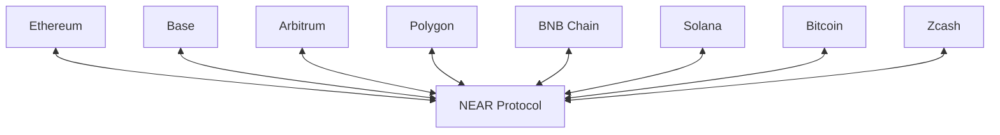

## Chain Overview

| Chain | Type | ChainKind | Prefix | Status |
|-------|------|-----------|--------|--------|
| Ethereum | EVM | `Eth` (0) | `eth:` | <Badge color="green" icon="circle-check">Live</Badge> |
| NEAR | Native | `Near` (1) | `near:` | <Badge color="green" icon="circle-check">Live</Badge> |
| Solana | Native | `Sol` (2) | `sol:` | <Badge color="green" icon="circle-check">Live</Badge> |
| Arbitrum | EVM L2 | `Arb` (3) | `arb:` | <Badge color="green" icon="circle-check">Live</Badge> |
| Base | EVM L2 | `Base` (4) | `base:` | <Badge color="green" icon="circle-check">Live</Badge> |
| BNB Chain | EVM | `Bnb` (5) | `bnb:` | <Badge color="green" icon="circle-check">Live</Badge> |
| Bitcoin | UTXO | `Btc` (6) | `btc:` | <Badge color="green" icon="circle-check">Live</Badge> |
| Zcash | UTXO | `Zcash` (7) | `zec:` | <Badge color="green" icon="circle-check">Live</Badge> |
| Polygon | EVM | `Pol` (8) | `pol:` | <Badge color="green" icon="circle-check">Live</Badge> |

## EVM Chains

All EVM chains use the same builder with different `ChainKind`:

```typescript
import { createEvmBuilder } from "@omni-bridge/evm"
import { ChainKind } from "@omni-bridge/core"

const ethBuilder = createEvmBuilder({ network: "mainnet", chain: ChainKind.Eth })
const baseBuilder = createEvmBuilder({ network: "mainnet", chain: ChainKind.Base })
const arbBuilder = createEvmBuilder({ network: "mainnet", chain: ChainKind.Arb })
const polBuilder = createEvmBuilder({ network: "mainnet", chain: ChainKind.Pol })
const bnbBuilder = createEvmBuilder({ network: "mainnet", chain: ChainKind.Bnb })
```

### Chain IDs

<Tabs>
  <Tab title="Mainnet">
    | Chain | Chain ID |
    |-------|----------|
    | Ethereum | 1 |
    | Arbitrum | 42161 |
    | Base | 8453 |
    | BNB Chain | 56 |
    | Polygon | 137 |
  </Tab>
  <Tab title="Testnet">
    | Chain | Chain ID |
    |-------|----------|
    | Ethereum (Sepolia) | 11155111 |
    | Arbitrum (Sepolia) | 421614 |
    | Base (Sepolia) | 84532 |
    | BNB Chain | 97 |
    | Polygon (Amoy) | 80002 |
  </Tab>
</Tabs>

## NEAR Protocol

```typescript
import { createNearBuilder } from "@omni-bridge/near"

const nearBuilder = createNearBuilder({ network: "mainnet" })
```

NEAR is the hub of the Omni Bridge. All cross-chain tokens are registered on NEAR, and transfers between non-NEAR chains route through NEAR.

<Note>
  NEAR uses 24-decimal precision for wrapped tokens, ensuring high-precision transfers from any chain.
</Note>

## Solana

```typescript
import { createSolanaBuilder } from "@omni-bridge/solana"
import { Connection } from "@solana/web3.js"

const connection = new Connection("https://api.mainnet-beta.solana.com")
const solanaBuilder = createSolanaBuilder({ 
  network: "mainnet",
  connection  // optional, uses public RPC if not provided
})
```

Solana transfers use the Wormhole bridge for cross-chain messaging.

## Bitcoin & Zcash

```typescript
import { createBtcBuilder } from "@omni-bridge/btc"

const btcBuilder = createBtcBuilder({ network: "mainnet", chain: "btc" })
const zecBuilder = createBtcBuilder({ network: "mainnet", chain: "zcash" })
```

UTXO chains (Bitcoin and Zcash) use a different flow:
- **Deposits**: Generate a deposit address, send funds, then finalize on NEAR
- **Withdrawals**: Initiate on NEAR, MPC signs, broadcast to network

## Transfer Routes

All transfers route through NEAR:



<Note>
  Direct transfers between non-NEAR chains (e.g., Ethereum → Solana) are handled automatically, but internally route through NEAR.
</Note>

## Bridge Contracts

Each chain has a bridge contract deployed:

<Tabs>
  <Tab title="Mainnet">
    ### EVM Bridge Contracts

    | Chain | Contract Address |
    |-------|------------------|
    | Ethereum | `0xe00c629aFaCCb0510995A2B95560E446A24c85B9` |
    | Base | `0xd025b38762B4A4E36F0Cde483b86CB13ea00D989` |
    | Arbitrum | `0xd025b38762B4A4E36F0Cde483b86CB13ea00D989` |
    | Polygon | `0xd025b38762B4A4E36F0Cde483b86CB13ea00D989` |
    | BNB Chain | `0x073C8a225c8Cf9d3f9157F5C1a1DbE02407f5720` |

    ### NEAR Contracts

    | Contract | Account ID |
    |----------|------------|
    | Omni Bridge | `omni.bridge.near` |
    | BTC Connector | `btc-connector.bridge.near` |
    | Zcash Connector | `zcash-connector.bridge.near` |
    | nBTC Token | `nbtc.bridge.near` |
    | nZEC Token | `nzec.bridge.near` |

    ### Solana Program

    | Program | Address |
    |---------|---------|
    | Bridge Token Factory | `dahPEoZGXfyV58JqqH85okdHmpN8U2q8owgPUXSCPxe` |
  </Tab>
  <Tab title="Testnet">
    ### EVM Bridge Contracts

    | Chain | Contract Address |
    |-------|------------------|
    | Ethereum (Sepolia) | `0x68a86e0Ea5B1d39F385c1326e4d493526dFe4401` |
    | Base (Sepolia) | `0xa56b860017152cD296ad723E8409Abd6e5D86d4d` |
    | Arbitrum (Sepolia) | `0x0C981337fFe39a555d3A40dbb32f21aD0eF33FFA` |
    | Polygon (Amoy) | `0xEC81aFc3485a425347Ac03316675e58a680b283A` |
    | BNB Chain | `0xEC81aFc3485a425347Ac03316675e58a680b283A` |

    ### NEAR Contracts

    | Contract | Account ID |
    |----------|------------|
    | Omni Bridge | `omni.n-bridge.testnet` |
    | BTC Connector | `btc-connector.n-bridge.testnet` |
    | Zcash Connector | `zcash_connector.n-bridge.testnet` |
    | nBTC Token | `nbtc.n-bridge.testnet` |
    | nZEC Token | `nzcash.n-bridge.testnet` |

    ### Solana Program (Devnet)

    | Program | Address |
    |---------|---------|
    | Bridge Token Factory | `862HdJV59Vp83PbcubUnvuXc4EAXP8CDDs6LTxFpunTe` |
  </Tab>
</Tabs>

<Tip>
  Use `bridge.addresses` to get the current contract addresses for your network:
  
  ```typescript
  const bridge = createBridge({ network: "mainnet" })
  console.log(bridge.addresses.eth.bridge)  // EVM bridge address
  console.log(bridge.addresses.near.contract)  // NEAR contract
  ```
</Tip>

<Note>
  **Verifying Contract Addresses**

  Always verify contract addresses on block explorers before interacting with them:
  
  - **Ethereum**: [Etherscan](https://etherscan.io)
  - **Base**: [Basescan](https://basescan.org)
  - **Arbitrum**: [Arbiscan](https://arbiscan.io)
  - **Polygon**: [Polygonscan](https://polygonscan.com)
  - **BNB Chain**: [BscScan](https://bscscan.com)
  - **NEAR**: [NEAR Explorer](https://nearblocks.io)
  - **Solana**: [Solscan](https://solscan.io)
  
  For testnets, use the corresponding testnet explorers (e.g., sepolia.etherscan.io).
</Note>

## Next Steps

<CardGroup cols={2}>
  <Card title="EVM Transfers" icon="ethereum" href="/guides/evm-transfers">
    Transfer from Ethereum, Base, Arbitrum
  </Card>
  <Card title="NEAR Transfers" icon="circle-nodes" href="/guides/near-transfers">
    Transfer from NEAR Protocol
  </Card>
  <Card title="Solana Transfers" icon="sun" href="/guides/solana-transfers">
    Transfer from Solana
  </Card>
  <Card title="Bitcoin Transfers" icon="bitcoin" href="/guides/bitcoin-transfers">
    Bridge Bitcoin and Zcash
  </Card>
</CardGroup>
