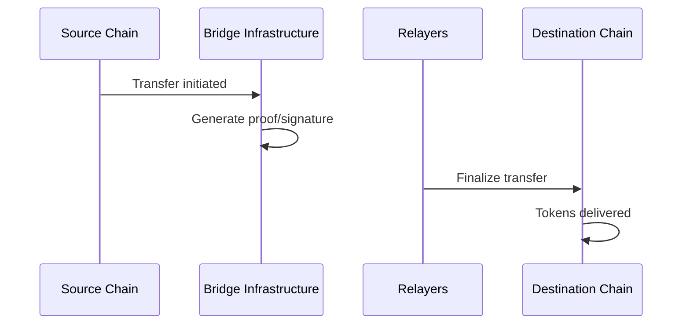

Every cross-chain transfer — regardless of source or destination chain — follows the same three-step pattern. Understanding this flow helps you debug issues and build better integrations.

## The Three Steps


### 1. Validate

```typescript
const validated = await bridge.validateTransfer({
  token: "eth:0xA0b86991c6218b36c1d19D4a2e9Eb0cE3606eB48",
  amount: 1_000_000n,
  sender: "eth:0x...",
  recipient: "near:alice.near",
  fee: 0n,
  nativeFee: 0n,
})
```

The SDK checks:
- **Address validity** — Is the format correct for each chain?
- **Token registration** — Is this token supported by the bridge?
- **Amount normalization** — Will this amount survive decimal conversion? (See [Decimal Normalization](/core-concepts/decimals))
- **Fee structure** — Are the fee amounts valid?

If anything fails, you get a `ValidationError` with a specific error code.

### 2. Build

```typescript
const tx = builder.buildTransfer(validated)
```

The builder encodes everything into an unsigned transaction for the source chain. What you get back depends on the chain:

| Chain | Return Type | Works With |
|-------|-------------|------------|
| EVM | `{ to, data, value, chainId }` | viem, ethers |
| NEAR | `{ signerId, receiverId, actions }` | near-kit, @near-js/* (via shims) |
| Solana | `TransactionInstruction[]` | @solana/web3.js |

The SDK handles:
- Contract addresses for the current network
- Function call encoding
- Gas limits and deposits (where applicable)

### 3. Sign & Send

```typescript
await wallet.sendTransaction(tx)
```

You sign and broadcast using whatever library or wallet you prefer. The SDK intentionally doesn't handle signing — this keeps it flexible for any key management setup.

## What Happens After You Send

Once your transaction confirms on the source chain:



1. **Proof generation** — The bridge infrastructure creates a cryptographic proof of your transfer
2. **Relayer pickup** — If you included fees, relayers compete to finalize your transfer
3. **Finalization** — The relayer submits the proof to the destination chain
4. **Delivery** — Tokens arrive in the recipient's account

This typically takes 5-20 minutes depending on the chains involved.

## With and Without Relayers

You have two options for finalization:

| Approach | How It Works | When to Use |
|----------|--------------|-------------|
| **With fees** | Relayers finalize automatically | Most use cases — simple, reliable |
| **Without fees** | You finalize manually | Cost savings, custom timing needs |

With fees (`fee` and/or `nativeFee` > 0):
```typescript
await bridge.validateTransfer({
  // ...
  fee: 1_000_000n,      // Pay from transfer amount
  nativeFee: 1_000_000_000_000_000n,  // Pay in native token
})
```

Without fees, you'll need to call the finalization methods yourself. See [Manual Finalization](/guides/advanced/manual-finalization).

## The ValidatedTransfer Object

After validation, you get an object containing everything the builders need:

```typescript
interface ValidatedTransfer {
  // Original parameters
  params: TransferParams
  
  // Resolved chain information
  sourceChain: ChainKind
  destChain: ChainKind
  
  // Amounts normalized for cross-chain safety
  normalizedAmount: bigint
  normalizedFee: bigint
  
  // Contract to interact with
  contractAddress: string
  
  // Token address on destination (if different)
  bridgedToken?: OmniAddress
}
```

The builders use this to construct the correct transaction. You shouldn't need to inspect it directly, but it's useful for debugging.

## Error Handling

Validation errors have specific codes you can handle:

```typescript
import { ValidationError } from "@omni-bridge/core"

try {
  const validated = await bridge.validateTransfer(params)
} catch (error) {
  if (error instanceof ValidationError) {
    switch (error.code) {
      case "INVALID_ADDRESS":
        // Address format is wrong for the specified chain
        break
      case "TOKEN_NOT_REGISTERED":
        // Token isn't supported by the bridge
        break
      case "AMOUNT_TOO_SMALL":
        // Amount won't survive decimal normalization
        break
    }
  }
}
```

## Chain-Specific Details

While the pattern is the same, each chain has quirks:

- **EVM**: Requires a separate approval transaction for ERC20 tokens
- **NEAR**: Requires storage deposits before first transfer
- **Solana**: Returns instructions, not a complete transaction
- **Bitcoin**: Uses a different flow entirely (deposit address + finalization)

The chain-specific guides cover these details:
- [EVM Guide](/guides/evm)
- [NEAR Guide](/guides/near)
- [Solana Guide](/guides/solana)
- [Bitcoin Guide](/guides/bitcoin)
