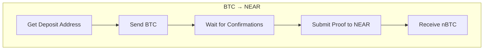
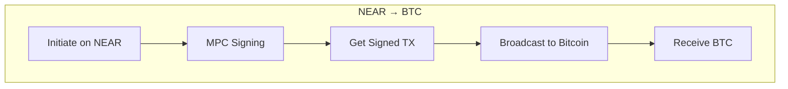

# Bitcoin Bridge

This example demonstrates the complete flow for bridging Bitcoin to and from NEAR Protocol. The bridge uses a two-step process with MPC signatures for security.

<Note>
Working examples are available in the repository at [`examples/bitcoin-deposit.ts`](https://github.com/Near-one/omni-bridge/tree/main/examples/bitcoin-deposit.ts) and [`examples/bitcoin-withdraw.ts`](https://github.com/Near-one/omni-bridge/tree/main/examples/bitcoin-withdraw.ts).
</Note>

## Transfer Flow





## Bitcoin Deposit (BTC → NEAR)

Depositing Bitcoin into the bridge to receive nBTC on NEAR is a two-step process:

<Steps>
  <Step title="Get Deposit Address">
    Generate a unique Bitcoin address for your NEAR account.
  </Step>
  <Step title="Send Bitcoin">
    Send BTC to the generated address and wait for confirmations.
  </Step>
  <Step title="Finalize Deposit">
    Submit a proof to NEAR to mint nBTC tokens.
  </Step>
</Steps>

### Complete Deposit Example

```typescript
import { createBridge, ChainKind, getAddresses } from "@omni-bridge/core"
import { createBtcBuilder } from "@omni-bridge/btc"
import { createNearBuilder, toNearKitTransaction } from "@omni-bridge/near"
import { Near } from "near-kit"

const NEAR_ACCOUNT = "alice.near"
const NETWORK = "mainnet"

async function depositBitcoin() {
  const bridge = createBridge({ network: NETWORK })
  const btcBuilder = createBtcBuilder({ network: NETWORK, chain: "btc" })
  const nearBuilder = createNearBuilder({ network: NETWORK })

  // Step 1: Get deposit address
  const depositResult = await bridge.getUtxoDepositAddress(
    ChainKind.Btc,
    NEAR_ACCOUNT
  )

  console.log("Send Bitcoin to:", depositResult.address)
  console.log("Minimum deposit:", "Check connector config for min_deposit_amount")

  // Step 2: User sends BTC externally...
  // Wait for 2+ confirmations (~20 minutes on testnet)

  // Step 3: Finalize deposit (after BTC is confirmed)
  const TX_HASH = "your-bitcoin-tx-hash"
  const VOUT = 0 // Output index

  // Get deposit proof from Bitcoin network
  const proof = await btcBuilder.getDepositProof(TX_HASH, VOUT)

  console.log("Proof generated:")
  console.log("  Amount:", proof.amount, "satoshis")
  console.log("  Block:", proof.tx_block_blockhash)

  // Build finalization transaction
  const finalizeTx = nearBuilder.buildUtxoDepositFinalization({
    chain: "btc",
    depositMsg: {
      recipient_id: NEAR_ACCOUNT,
    },
    txBytes: proof.tx_bytes,
    vout: VOUT,
    txBlockBlockhash: proof.tx_block_blockhash,
    txIndex: proof.tx_index,
    merkleProof: proof.merkle_proof,
    signerId: NEAR_ACCOUNT,
  })

  // Send to NEAR
  const near = new Near({
    network: NETWORK,
    privateKey: "ed25519:...",
    defaultSignerId: NEAR_ACCOUNT,
  })

  const result = await toNearKitTransaction(near, finalizeTx).send({
    waitUntil: "FINAL",
  })

  console.log("Deposit finalized:", result.transaction.hash)

  // Check new balance
  const balance = await nearBuilder.getUtxoTokenBalance("btc", NEAR_ACCOUNT)
  console.log("nBTC Balance:", balance, "satoshis")
}
```

## Bitcoin Withdrawal (NEAR → BTC)

Withdrawing from NEAR to Bitcoin involves building a withdrawal plan, initiating on NEAR, waiting for MPC signing, and broadcasting.

<Steps>
  <Step title="Check Balance">
    Verify nBTC balance and connector configuration.
  </Step>
  <Step title="Build Withdrawal Plan">
    Select UTXOs and calculate fees.
  </Step>
  <Step title="Initiate on NEAR">
    Send ft_transfer_call to start the withdrawal.
  </Step>
  <Step title="Wait for MPC Signing">
    The MPC network signs the Bitcoin transaction.
  </Step>
  <Step title="Broadcast">
    Broadcast the signed transaction to Bitcoin.
  </Step>
</Steps>

### Complete Withdrawal Example

```typescript
import { createBtcBuilder } from "@omni-bridge/btc"
import { BridgeAPI, type UTXO } from "@omni-bridge/core"
import { createNearBuilder, toNearKitTransaction } from "@omni-bridge/near"
import { Near } from "near-kit"

const NEAR_ACCOUNT = "alice.near"
const BTC_ADDRESS = "bc1q..." // Your Bitcoin address
const NETWORK = "mainnet"

async function withdrawBitcoin() {
  const nearBuilder = createNearBuilder({ network: NETWORK })
  const btcBuilder = createBtcBuilder({ network: NETWORK, chain: "btc" })
  const api = new BridgeAPI(NETWORK)

  // Step 1: Check balance and config
  const balance = await nearBuilder.getUtxoTokenBalance("btc", NEAR_ACCOUNT)
  const config = await nearBuilder.getUtxoConnectorConfig("btc")

  console.log("nBTC Balance:", balance, "satoshis")
  console.log("Min Withdraw:", config.min_withdraw_amount)
  console.log("Change Address:", config.change_address)

  const withdrawAmount = BigInt(config.min_withdraw_amount)

  // Step 2: Build withdrawal plan
  const utxos: UTXO[] = await nearBuilder.getUtxoAvailableOutputs("btc")
  console.log("Available UTXOs:", utxos.length)

  const plan = btcBuilder.buildWithdrawalPlan(
    utxos,
    withdrawAmount,
    BTC_ADDRESS,
    config.change_address,
    2 // fee rate in sat/vB
  )

  const bridgeFee = await nearBuilder.calculateUtxoWithdrawalFee("btc", withdrawAmount)
  const totalAmount = withdrawAmount + plan.fee + bridgeFee

  console.log("Withdrawal Plan:")
  console.log("  Amount:", withdrawAmount, "satoshis")
  console.log("  Network Fee:", plan.fee, "satoshis")
  console.log("  Bridge Fee:", bridgeFee, "satoshis")
  console.log("  Total:", totalAmount, "satoshis")

  if (balance < totalAmount) {
    throw new Error(`Insufficient balance: have ${balance}, need ${totalAmount}`)
  }

  // Step 3: Initiate on NEAR
  const near = new Near({
    network: NETWORK,
    privateKey: "ed25519:...",
    defaultSignerId: NEAR_ACCOUNT,
  })

  const withdrawTx = nearBuilder.buildUtxoWithdrawalInit({
    chain: "btc",
    targetAddress: BTC_ADDRESS,
    inputs: plan.inputs,
    outputs: plan.outputs,
    totalAmount,
    signerId: NEAR_ACCOUNT,
  })

  const result = await toNearKitTransaction(near, withdrawTx).send({
    waitUntil: "FINAL",
  })

  console.log("Withdrawal initiated:", result.transaction.hash)

  // Step 4: Wait for MPC signing
  console.log("Waiting for MPC signing...")

  let signedTxHash: string | undefined

  for (let i = 0; i < 60; i++) {
    const transfers = await api.getTransfer({
      transactionHash: result.transaction.hash,
    })
    const transfer = transfers[0]

    if (transfer?.signed?.NearReceipt?.transaction_hash) {
      signedTxHash = transfer.signed.NearReceipt.transaction_hash
      break
    }

    console.log(`  Attempt ${i + 1}/60...`)
    await new Promise((r) => setTimeout(r, 5000))
  }

  if (!signedTxHash) {
    throw new Error("MPC signing timed out")
  }

  console.log("Signed TX Hash:", signedTxHash)

  // Step 5: Extract and broadcast signed transaction
  const signedTx = await near.getTransactionStatus(
    signedTxHash,
    NEAR_ACCOUNT,
    "FINAL"
  )

  // Find signed_btc_transaction event in logs
  const signedLog = signedTx.receipts_outcome
    .flatMap((r) => r.outcome.logs)
    .find((log) => log.includes("signed_btc_transaction"))

  if (!signedLog) {
    throw new Error("Signed transaction not found in logs")
  }

  const jsonPart = signedLog.split("EVENT_JSON:")[1]
  const signedData = JSON.parse(jsonPart)
  const txBytes: number[] = signedData.data[0].tx_bytes

  // Convert to hex and broadcast
  const txHex = txBytes.map((b) => b.toString(16).padStart(2, "0")).join("")
  const btcTxHash = await btcBuilder.broadcastTransaction(txHex)

  console.log("Bitcoin TX broadcast:", btcTxHash)
  console.log("Explorer:", `https://mempool.space/tx/${btcTxHash}`)
}
```

## Zcash Support

The same patterns work for Zcash with minor changes:

```typescript
import { createBtcBuilder } from "@omni-bridge/btc"
import { ChainKind } from "@omni-bridge/core"

// Use "zcash" chain type
const zcashBuilder = createBtcBuilder({ network: "mainnet", chain: "zcash" })

// For deposits
const depositResult = await bridge.getUtxoDepositAddress(
  ChainKind.Zcash,
  NEAR_ACCOUNT
)

// For withdrawals - uses ZIP-317 fee calculation automatically
const plan = zcashBuilder.buildWithdrawalPlan(
  utxos,
  amount,
  "t1...", // Zcash transparent address
  config.change_address
)

// NEAR builder methods accept "zcash" chain parameter
const balance = await nearBuilder.getUtxoTokenBalance("zcash", NEAR_ACCOUNT)
const config = await nearBuilder.getUtxoConnectorConfig("zcash")
```

## Post-Actions

When depositing, you can specify automatic actions to execute after minting:

```typescript
// Deposit BTC and automatically bridge to Ethereum
const depositResult = await bridge.getUtxoDepositAddress(
  ChainKind.Btc,
  NEAR_ACCOUNT,
  {
    postActions: [
      {
        receiver_id: "bridge.near",
        amount: "0", // Will use deposited amount
        msg: JSON.stringify({
          recipient: "eth:0xYourEthAddress...",
        }),
      },
    ],
  }
)
```

## Fee Calculation

### Network Fees

The BTC builder uses a linear fee calculator based on transaction size:

```typescript
import { linearFeeCalculator } from "@omni-bridge/btc"

// Custom fee calculator
const feeCalc = linearFeeCalculator({
  base: 10,    // Base transaction overhead
  input: 68,   // Bytes per input
  output: 31,  // Bytes per output
  rate: 5,     // Satoshis per vByte
})

const plan = btcBuilder.buildWithdrawalPlan(
  utxos,
  amount,
  targetAddress,
  changeAddress,
  5 // fee rate passed to builder
)
```

### Bridge Fees

```typescript
// Calculate bridge fee (percentage + minimum)
const fee = await nearBuilder.calculateUtxoWithdrawalFee("btc", amount)

// Fee structure from config
const config = await nearBuilder.getUtxoConnectorConfig("btc")
console.log("Fee rate:", config.withdraw_bridge_fee.fee_rate, "basis points")
console.log("Minimum fee:", config.withdraw_bridge_fee.fee_min, "satoshis")
```

## UTXO Selection

The builder automatically selects UTXOs using a largest-first strategy:

```typescript
// Custom UTXO selection
const selection = btcBuilder.selectUtxos(normalizedUtxos, targetAmount, {
  dustThreshold: 546n,
  minChange: 1000n,
  sort: "largest-first", // or "smallest-first"
  maxInputs: 10,
})

console.log("Selected:", selection.inputs.length, "UTXOs")
console.log("Total input:", selection.totalInput)
console.log("Fee:", selection.fee)
console.log("Change:", selection.change)
```

## Error Handling

```typescript
try {
  const proof = await btcBuilder.getDepositProof(txHash, vout)
} catch (error) {
  if (error.message.includes("not confirmed")) {
    console.error("Wait for more Bitcoin confirmations (need 2+)")
  } else if (error.message.includes("not found")) {
    console.error("Transaction not found - check TX hash")
  }
}

try {
  const plan = btcBuilder.buildWithdrawalPlan(utxos, amount, to, change)
} catch (error) {
  if (error.message.includes("No UTXOs")) {
    console.error("No UTXOs available in bridge pool")
  } else if (error.message.includes("Insufficient")) {
    console.error("Not enough UTXOs to cover amount + fees")
  }
}
```

## Next Steps

<CardGroup cols={2}>
  <Card title="UTXO Selection" icon="coins" href="/reference/btc/utxo-selection">
    Advanced UTXO selection strategies
  </Card>
  <Card title="Fee Calculation" icon="calculator" href="/reference/btc/fee-calculation">
    Understanding BTC and Zcash fees
  </Card>
</CardGroup>
