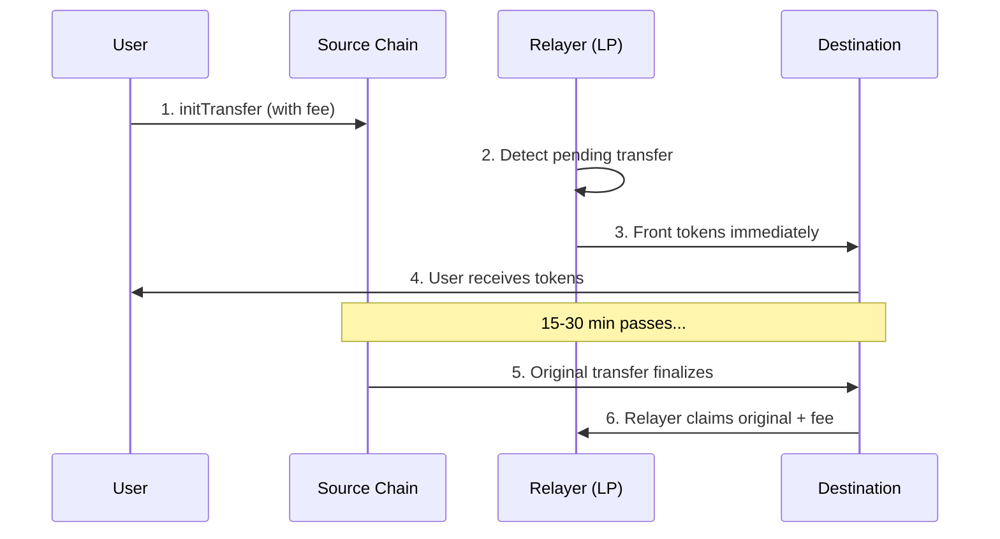

<Note>
This is an advanced topic for relayer operators and liquidity providers. Regular users benefit automatically when relayers offer fast finalization.
</Note>

Fast transfers let liquidity providers front tokens on the destination chain before the original transfer fully finalizes. Users receive tokens in seconds instead of minutes.

## How It Works



1. User initiates transfer with fees
2. Relayer sees the pending transfer
3. Relayer sends their own tokens to the recipient immediately
4. User gets tokens in seconds
5. Original transfer finalizes normally
6. Relayer claims the original tokens plus fee as profit

## Building Fast Finalization Transactions

```typescript
import { createNearBuilder } from "@omni-bridge/near"
import type { FastFinTransferParams } from "@omni-bridge/near"

const nearBuilder = createNearBuilder({ network: "mainnet" })

const params: FastFinTransferParams = {
  tokenId: "wrap.near",
  amount: "1000000000000000000000000",      // Original amount
  amountToSend: "990000000000000000000000", // Amount minus fee
  transferId: {
    origin_chain: "Eth",
    origin_nonce: 12345n,
  },
  recipient: "near:recipient.near",
  fee: {
    fee: "10000000000000000000000",  // Token fee
    native_fee: "0",
  },
  msg: "",
  storageDepositAmount: "1250000000000000000000",
  relayer: "relayer.near",
}

const tx = nearBuilder.buildFastFinTransfer(params, "relayer.near")
```

## Economics

| Party | What happens |
|-------|--------------|
| **User** | Receives `amount - fee` immediately |
| **Relayer** | Fronts `amount - fee`, claims `amount` later |
| **Profit** | `fee` (after original finalizes) |

```typescript
const originalAmount = 1000n * 10n**24n  // 1000 tokens
const fee = 10n * 10n**24n               // 10 tokens (1%)
const amountToSend = originalAmount - fee // 990 tokens

// Relayer fronts 990 tokens
// Relayer claims 1000 tokens after finalization
// Profit: 10 tokens
```

## Risks

<Warning>
Relayers lock capital until the original transfer finalizes. This introduces financial and operational risks.
</Warning>

| Risk | Description | Mitigation |
|------|-------------|------------|
| **Capital lock** | Tokens locked for 15-30 min | Maintain sufficient liquidity |
| **Reorg risk** | Source chain reorg invalidates transfer | Wait for confirmations |
| **Invalid transfer** | Original transfer fails validation | Verify on-chain data |
| **Claim failure** | Network issues during claim | Implement retry logic |

## Validation Checklist

Before executing a fast transfer:

```typescript
function shouldExecuteFastTransfer(transfer: PendingTransfer): boolean {
  // 1. Verify transfer exists on source chain
  if (!await verifyTransferOnSource(transfer)) return false
  
  // 2. Check not already finalized
  if (await isAlreadyFinalized(transfer.transferId)) return false
  
  // 3. Verify fee covers gas + profit margin
  const gasCost = await estimateGasCost()
  if (transfer.fee <= gasCost) return false
  
  // 4. Check liquidity
  if (!hasLiquidity(transfer.tokenId, transfer.amountToSend)) return false
  
  // 5. Validate recipient
  if (!isValidAddress(transfer.recipient)) return false
  
  return true
}
```

## Transfer States

| Status | Meaning |
|--------|---------|
| `Pending` | Fast transfer executed, waiting for original |
| `Finalized` | Original transfer finalized, fee claimable |
| `Claimed` | Relayer claimed original tokens + fee |

## Capital Requirements

Relayers need liquidity across multiple tokens:

```typescript
const requiredLiquidity = {
  "wrap.near": 100_000n * 10n**24n,  // 100k wNEAR
  "usdc.near": 500_000n * 10n**6n,   // 500k USDC
  "usdt.near": 500_000n * 10n**6n,   // 500k USDT
}
```

## See Also

- [Relayer Fees](/guides/fees) — Standard fee structure
- [Manual Finalization](/guides/advanced/manual-finalization) — Standard finalization flow
- [Tracking Transfers](/guides/tracking) — Monitor transfer status
