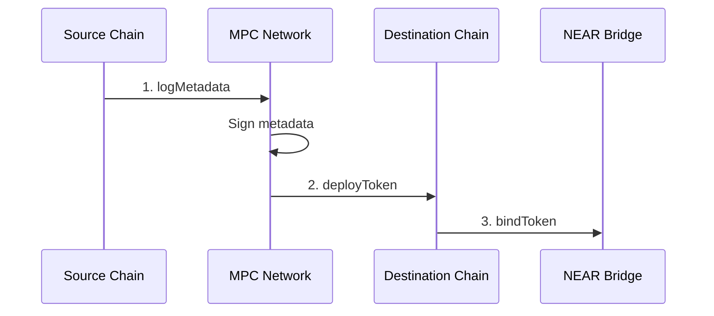

Before a token can be bridged for the first time, it must be deployed on the destination chain and registered with the bridge. This is a one-time setup per token per chain pair.

<Info>
Most popular tokens are already deployed. Check if a token exists before deploying.
</Info>

## When Is This Needed?

- First time bridging a new ERC20 from Ethereum to NEAR
- First time bridging a NEP-141 from NEAR to an EVM chain
- Bridging to a new destination where the token doesn't exist yet

## The Process



1. **Log Metadata** — Record token's name, symbol, decimals on source chain
2. **Deploy Token** — Create wrapped token contract on destination
3. **Bind Token** — Associate source and destination addresses in the bridge

## EVM Token → NEAR

### Step 1: Log Metadata (EVM)

```typescript
import { createEvmBuilder } from "@omni-bridge/evm"
import { ChainKind } from "@omni-bridge/core"

const evm = createEvmBuilder({ network: "mainnet", chain: ChainKind.Eth })

const tx = evm.buildLogMetadata("0xTokenAddress...")
await walletClient.sendTransaction(tx)
```

### Step 2: Deploy Token (NEAR)

After the metadata is signed (check Wormhole for VAA or wait for MPC signature):

```typescript
import { createNearBuilder, ProofKind, toNearKitTransaction } from "@omni-bridge/near"

const nearBuilder = createNearBuilder({ network: "mainnet" })

const proverArgs = nearBuilder.serializeWormholeProofArgs({
  proof_kind: ProofKind.LogMetadata,
  vaa: vaaBytes,
})

const tx = nearBuilder.buildDeployToken(
  ChainKind.Eth,
  proverArgs,
  signerId,
  5_000_000_000_000_000_000_000_000n  // ~5 NEAR for storage
)

await toNearKitTransaction(near, tx).send()
```

### Step 3: Bind Token (NEAR)

Extract the deployment proof and bind:

```typescript
const proverArgs = nearBuilder.serializeEvmProofArgs({
  proof_kind: ProofKind.DeployToken,
  proof: deploymentProof,
})

const tx = nearBuilder.buildBindToken(
  ChainKind.Eth,
  proverArgs,
  signerId,
  1_000_000_000_000_000_000_000_000n  // ~1 NEAR
)

await toNearKitTransaction(near, tx).send()
```

## NEAR Token → EVM

### Step 1: Log Metadata (NEAR)

```typescript
const tx = nearBuilder.buildLogMetadata("token.near", signerId)
const result = await toNearKitTransaction(near, tx).send()

// Parse LogMetadataEvent from logs
const eventLog = result.receipts_outcome
  .flatMap((r) => r.outcome.logs)
  .find((log) => log.includes("LogMetadataEvent"))

const metadataEvent = JSON.parse(eventLog).LogMetadataEvent
```

### Step 2: Deploy Token (EVM)

```typescript
const tx = evm.buildDeployToken(
  metadataEvent.signature,
  {
    token: metadataEvent.metadata_payload.token,
    name: metadataEvent.metadata_payload.name,
    symbol: metadataEvent.metadata_payload.symbol,
    decimals: metadataEvent.metadata_payload.decimals,
  }
)

await walletClient.sendTransaction(tx)
```

### Step 3: Bind Token (NEAR)

Same as above — get the EVM deployment proof and call `buildBindToken`.

## NEAR Token → Solana

```typescript
import { createSolanaBuilder } from "@omni-bridge/solana"
import { MPCSignature } from "@omni-bridge/near"

const solBuilder = createSolanaBuilder({ network: "mainnet", connection })

// After logging metadata on NEAR
const signature = MPCSignature.fromRaw(metadataEvent.signature)

// Derive expected mint address
const expectedMint = solBuilder.deriveWrappedMint(metadataEvent.metadata_payload.token)

// Build deploy instructions
const instructions = await solBuilder.buildDeployToken(
  signature,
  {
    token: metadataEvent.metadata_payload.token,
    name: metadataEvent.metadata_payload.name,
    symbol: metadataEvent.metadata_payload.symbol,
    decimals: metadataEvent.metadata_payload.decimals,
  },
  payer
)

// Send transaction
const tx = new Transaction()
tx.add(...instructions)
await sendAndConfirmTransaction(connection, tx, [keypair])
```

<Note>
Solana doesn't require a separate bind step — the mapping is established during deployment.
</Note>

## Checking If Already Deployed

```typescript
import { BridgeAPI } from "@omni-bridge/core"

const api = new BridgeAPI("mainnet")
const tokenInfo = await api.getTokenInfo("eth:0xTokenAddress...")

if (tokenInfo.nearTokenId) {
  console.log("Already deployed:", tokenInfo.nearTokenId)
} else {
  console.log("Needs deployment")
}
```

## Native Token Deployment

Native tokens (ETH, MATIC, BNB) use the zero address:

```typescript
const tx = evm.buildLogMetadata(
  "0x0000000000000000000000000000000000000000"
)
```

The bridge uses hardcoded metadata for native tokens.

<Warning>
Native token deployment on NEAR requires the DAO role. Regular users cannot deploy native tokens.
</Warning>

## Common Errors

| Error | Cause | Solution |
|-------|-------|----------|
| `ERR_TOKEN_EXIST` | Already deployed | Use existing token |
| `ERR_INVALID_METADATA` | Empty name/symbol | Check token contract |
| `InvalidSignature` | Signature verification failed | Wait for signing, check format |
| `ERR_INVALID_PROOF` | Invalid/expired proof | Regenerate from source |

## Prerequisites

- Gas on source chain (for `logMetadata`)
- Gas on destination chain (for `deployToken`)
- NEAR tokens for storage (for `bindToken`)
- Valid ERC20 or NEP-141 token
