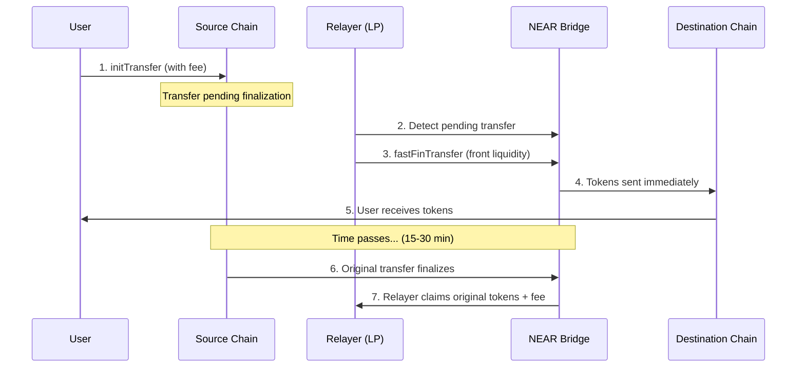

## Overview

Fast transfers allow liquidity providers (relayers) to front tokens on the destination chain before the original transfer is fully finalized. This enables users to receive tokens in seconds instead of waiting for full cross-chain finality.

| Standard Transfer | Fast Transfer |
|-------------------|---------------|
| Wait 15-30 minutes for finality | Receive tokens immediately |
| Relayer claims fee after finalization | Relayer fronts liquidity upfront |
| Lower risk for relayers | Higher capital requirements |

<Info>
  Fast transfers are an advanced feature primarily used by liquidity providers and relayer operators. Regular users benefit automatically when relayers offer fast finalization services.
</Info>

## How It Works



<Steps>
  <Step title="User Initiates Transfer">
    User calls `initTransfer` on the source chain with a fee that incentivizes fast finalization.
  </Step>
  <Step title="Relayer Detects Transfer">
    Relayer monitors for pending transfers with sufficient fees and evaluates profitability.
  </Step>
  <Step title="Relayer Fronts Liquidity">
    Relayer calls `fastFinTransfer`, sending their own tokens to the bridge to fulfill the transfer immediately.
  </Step>
  <Step title="User Receives Tokens">
    The destination receives tokens within seconds, not minutes.
  </Step>
  <Step title="Original Transfer Finalizes">
    The source chain transfer completes its normal finalization process (proofs verified, etc.).
  </Step>
  <Step title="Relayer Claims Tokens">
    Once finalized, the relayer claims the original locked tokens plus the fee as profit.
  </Step>
</Steps>

## API Reference

### `buildFastFinTransfer`

Build a fast finalization transfer transaction. This is called by relayers to front liquidity for a pending transfer.

```typescript
import { createNearBuilder } from "@omni-bridge/near"
import type { FastFinTransferParams } from "@omni-bridge/near"

const nearBuilder = createNearBuilder({ network: "mainnet" })

const params: FastFinTransferParams = {
  // Token being transferred (NEAR account ID)
  tokenId: "wrap.near",
  
  // Original transfer amount (normalized, as string)
  amount: "1000000000000000000000000",
  
  // Amount relayer is actually sending (amount - fee)
  amountToSend: "990000000000000000000000",
  
  // Original transfer ID from source chain
  transferId: {
    origin_chain: "Eth",
    origin_nonce: 12345n,
  },
  
  // Recipient address
  recipient: "near:recipient.near",
  
  // Fee structure from original transfer
  fee: {
    fee: "10000000000000000000000",    // Token fee
    native_fee: "0",                    // Native fee
  },
  
  // Optional message for ft_transfer_call on destination
  msg: "",
  
  // Storage deposit for recipient (if needed)
  storageDepositAmount: "1250000000000000000000",
  
  // Relayer's NEAR account (receives fees on claim)
  relayer: "relayer.near",
}

const tx = nearBuilder.buildFastFinTransfer(params, "relayer.near")
```

### Parameters

| Parameter | Type | Description |
|-----------|------|-------------|
| `tokenId` | `string` | NEAR token account ID to transfer |
| `amount` | `string` | Original transfer amount (normalized) |
| `amountToSend` | `string` | Amount recipient receives (`amount - fee`) |
| `transferId` | `TransferId` | Original transfer ID from source chain |
| `recipient` | `OmniAddress` | Destination address for tokens |
| `fee` | `TransferFee` | Fee structure (`fee` + `native_fee`) |
| `msg` | `string` | Optional message for `ft_transfer_call` |
| `storageDepositAmount` | `string` | Storage deposit for recipient account |
| `relayer` | `string` | Relayer NEAR account ID |

## Fee Structure

Fast transfers use the same fee structure as standard transfers, but the economics work differently:

<Tabs>
  <Tab title="Relayer Perspective">
    **Capital flow:**
    1. Relayer sends `amountToSend` tokens immediately
    2. After finalization, relayer receives `amount` tokens (original locked amount)
    3. Profit = `amount - amountToSend` = `fee`
    
    ```typescript
    // Example calculation
    const originalAmount = 1000n * 10n**24n  // 1000 tokens
    const fee = 10n * 10n**24n               // 10 tokens (1%)
    const amountToSend = originalAmount - fee // 990 tokens
    
    // Relayer fronts 990 tokens
    // Relayer claims 1000 tokens after finalization
    // Profit: 10 tokens
    ```
  </Tab>
  
  <Tab title="User Perspective">
    Users see no difference — they receive `amount - fee` tokens regardless of whether standard or fast finalization is used. The benefit is speed.
    
    ```typescript
    // User sends 1000 USDC with 1% fee
    // User receives 990 USDC
    // 
    // Standard: receives in 15-30 minutes
    // Fast: receives in seconds
    ```
  </Tab>
</Tabs>

## Risks and Considerations

<Warning>
  Fast transfers require relayers to lock capital until the original transfer finalizes. This introduces financial and operational risks.
</Warning>

### For Relayers

| Risk | Description | Mitigation |
|------|-------------|------------|
| **Capital Lock** | Tokens are locked until source chain finalization (15-30 min) | Maintain sufficient liquidity pools |
| **Reorg Risk** | Source chain reorg could invalidate the original transfer | Wait for sufficient confirmations before fronting |
| **Invalid Transfer** | Original transfer may fail validation | Verify transfer parameters match on-chain data |
| **Fee Claim Failure** | Network issues during claim phase | Implement retry logic with exponential backoff |

### Security Checks

Before executing a fast transfer, relayers should verify:

```typescript
// Pseudocode for relayer validation
function shouldExecuteFastTransfer(transfer: PendingTransfer): boolean {
  // 1. Verify transfer exists on source chain
  if (!await verifyTransferOnSource(transfer)) return false
  
  // 2. Check transfer hasn't already been finalized
  if (await isAlreadyFinalized(transfer.transferId)) return false
  
  // 3. Verify fee is profitable after gas costs
  const gasCost = await estimateGasCost()
  if (transfer.fee <= gasCost) return false
  
  // 4. Check liquidity availability
  if (!hasLiquidity(transfer.tokenId, transfer.amountToSend)) return false
  
  // 5. Verify recipient address is valid
  if (!isValidAddress(transfer.recipient)) return false
  
  return true
}
```

### Capital Requirements

Relayers need to maintain liquidity in multiple tokens across chains:

```typescript
// Example liquidity requirements
const requiredLiquidity = {
  "wrap.near": 100_000n * 10n**24n,  // 100k wNEAR
  "usdc.near": 500_000n * 10n**6n,   // 500k USDC
  "usdt.near": 500_000n * 10n**6n,   // 500k USDT
}
```

## Fast Transfer States

The bridge contract tracks fast transfer status:

| Status | Description |
|--------|-------------|
| **Pending** | Fast transfer executed, waiting for original finalization |
| **Finalized** | Original transfer finalized, fee can be claimed |
| **Claimed** | Relayer has claimed the original tokens + fee |

<Info>
  The contract ensures relayers can only claim fees after the original transfer is verified. This prevents malicious relayers from creating fake fast transfers with inflated fees.
</Info>

## Monitoring Fast Transfers

Relayers should monitor for:

1. **New pending transfers** — Opportunities to provide fast finalization
2. **Finalized transfers** — Claim fees for completed fast transfers
3. **Failed claims** — Retry logic for network issues

```typescript
// Example monitoring loop
async function monitorFastTransfers() {
  // Watch for new transfer events
  const pendingTransfers = await api.getPendingTransfers()
  
  for (const transfer of pendingTransfers) {
    if (shouldExecuteFastTransfer(transfer)) {
      await executeFastTransfer(transfer)
    }
  }
  
  // Check for claimable fees
  const claimable = await getClaimableFastTransfers()
  for (const claim of claimable) {
    await claimFees(claim)
  }
}
```

## Next Steps

<CardGroup cols={2}>
  <Card title="Relayer Fees" icon="money-bill" href="/guides/relayer-fees">
    Standard fee structure and calculation
  </Card>
  <Card title="Manual Finalization" icon="hand" href="/guides/manual-finalization">
    Standard finalization flow details
  </Card>
  <Card title="NEAR Builder Reference" icon="circle-nodes" href="/reference/near/create-builder">
    Complete NEAR builder API
  </Card>
  <Card title="Tracking Transfers" icon="magnifying-glass" href="/guides/tracking-transfers">
    Monitor transfer status
  </Card>
</CardGroup>
