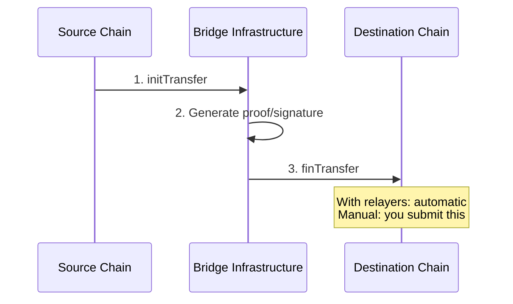

## Overview

When you initiate a transfer with `fee: 0n` and `nativeFee: 0n`, relayers won't process it automatically. You'll need to finalize the transfer yourself on the destination chain.

**When to use manual finalization:**
- Cost savings — avoid relayer fees entirely
- Custom relayer infrastructure — you're running your own
- Guaranteed control — specific timing or ordering requirements

## How It Works

Every cross-chain transfer follows this pattern:



With relayers, step 3 happens automatically. With manual finalization, **you** submit the finalization transaction.

## Proof Systems

Different source chains use different proof systems to verify transfers:

<Tabs>
  <Tab title="From NEAR">
    **Proof type:** MPC Signature
    
    Transfers from NEAR use the MPC (Multi-Party Computation) network:
    
    <Steps>
      <Step title="Initiate">
        Call `ft_transfer_call` on the token contract
      </Step>
      <Step title="Sign">
        Call `sign_transfer` on the bridge contract to trigger MPC signing
      </Step>
      <Step title="Parse">
        Extract the `SignTransferEvent` from transaction logs
      </Step>
      <Step title="Finalize">
        Submit signature + payload to destination chain
      </Step>
    </Steps>
    
    The MPC signature needs format conversion for each destination:
    - **EVM**: Add 27 to recovery ID (`MPCSignature.toBytes(true)`)
    - **Solana**: Use raw format (`MPCSignature.toBytes(false)`)
    
    <Info>
      See [buildSignTransfer](/reference/near/create-builder#buildsigntransfer) and [buildFinalization](/reference/evm/create-builder#buildfinalization) in the API reference.
    </Info>
  </Tab>
  
  <Tab title="From EVM">
    **Proof type:** Depends on the chain
    
    Different EVM chains use different proof systems:
    
    | Chain | Proof System |
    |-------|--------------|
    | Ethereum | Merkle Patricia Trie (light client) |
    | Base, Arbitrum, BNB, Polygon | Wormhole VAA |
    
    <Tabs>
      <Tab title="Ethereum (Merkle Proof)">
        <Steps>
          <Step title="Initiate">
            Call `initTransfer` on the bridge contract
          </Step>
          <Step title="Wait">
            Wait for block finality + NEAR light client sync (~15-20 min)
          </Step>
          <Step title="Generate proof">
            Build Merkle proof of the transaction receipt using `getEvmProof()`
          </Step>
          <Step title="Finalize">
            Submit proof to NEAR bridge contract
          </Step>
        </Steps>
        
        <Warning>
          Ethereum → NEAR finalization requires waiting for the NEAR light client to sync the Ethereum block. This can take 15-30 minutes.
        </Warning>
        
        <Info>
          See [getEvmProof](/reference/evm/proofs) and [buildFinalization](/reference/near/create-builder#buildfinalization) in the API reference.
        </Info>
      </Tab>
      
      <Tab title="L2s (Wormhole)">
        Base, Arbitrum, BNB, and Polygon use Wormhole for faster finalization:
        
        <Steps>
          <Step title="Initiate">
            Call `initTransfer` on the bridge contract
          </Step>
          <Step title="Wait">
            Wait for Wormhole guardians to sign (~1 min)
          </Step>
          <Step title="Fetch VAA">
            Get the signed VAA from Wormhole API
          </Step>
          <Step title="Finalize">
            Submit VAA to NEAR bridge contract
          </Step>
        </Steps>
        
        <Info>
          The SDK's `buildFinalization` accepts either `evmProof` or `vaa` parameter depending on the source chain.
        </Info>
      </Tab>
    </Tabs>
  </Tab>
  
  <Tab title="From Solana">
    **Proof type:** Wormhole VAA
    
    Transfers from Solana use Wormhole's guardian network:
    
    <Steps>
      <Step title="Initiate">
        Submit transfer instruction to Solana bridge program
      </Step>
      <Step title="Wait">
        Wait for Wormhole guardians to sign (~15 seconds)
      </Step>
      <Step title="Fetch VAA">
        Get the signed VAA from Wormhole
      </Step>
      <Step title="Finalize">
        Submit VAA to NEAR bridge contract
      </Step>
    </Steps>
    
    <Info>
      See the [Solana builder reference](/reference/solana/create-builder) for details.
    </Info>
  </Tab>
</Tabs>

## Transfer Status

Use the API to know when a transfer is ready for finalization:

```typescript
import { BridgeAPI } from "@omni-bridge/core"

const api = new BridgeAPI("mainnet")

// Poll for status
const statuses = await api.getTransferStatus({ transactionHash: txHash })

// Check if ready for finalization
if (statuses.includes("Signed")) {
  // NEAR → EVM: Ready to finalize on EVM
}

if (statuses.includes("Initialized")) {
  // EVM → NEAR: Wait for light client, then finalize on NEAR
}
```

See [Tracking Transfers](/guides/tracking-transfers) for more details on status monitoring.

## Finalization Builders

Each destination chain has a `buildFinalization` method:

| Destination | Builder | Reference |
|-------------|---------|-----------|
| EVM chains | `evmBuilder.buildFinalization(payload, signature)` | [API Reference](/reference/evm/create-builder#buildfinalization) |
| NEAR | `nearBuilder.buildFinalization(params)` | [API Reference](/reference/near/create-builder#buildfinalization) |
| Solana | `solanaBuilder.buildFinalization(params)` | [API Reference](/reference/solana/create-builder) |

## Complete Examples

For full working examples with imports and setup:

- **NEAR → EVM**: See the [near-to-eth e2e test](https://github.com/near-one/bridge-sdk-js/blob/main/e2e/near-to-eth.test.ts)
- **EVM → NEAR**: See the [eth-to-near e2e test](https://github.com/near-one/bridge-sdk-js/blob/main/e2e/eth-to-near.test.ts)

## When to Use Relayers Instead

Manual finalization adds complexity. Consider using [relayer fees](/guides/relayer-fees) if:

- You want a simple fire-and-forget experience
- The fee cost is acceptable for your use case
- You don't need precise control over finalization timing

## Next Steps

<CardGroup cols={2}>
  <Card title="Relayer Fees" icon="money-bill" href="/guides/relayer-fees">
    Automatic finalization with fees
  </Card>
  <Card title="Tracking Transfers" icon="magnifying-glass" href="/guides/tracking-transfers">
    Monitor transfer status
  </Card>
  <Card title="EVM Builder Reference" icon="ethereum" href="/reference/evm/create-builder">
    EVM finalization API
  </Card>
  <Card title="NEAR Builder Reference" icon="circle-nodes" href="/reference/near/create-builder">
    NEAR finalization API
  </Card>
</CardGroup>
