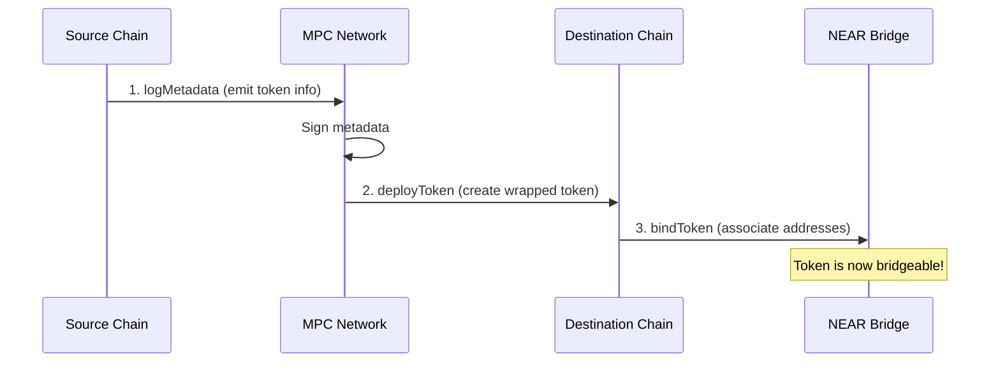

## Overview

Before a token can be bridged for the first time, it must be **deployed** on the destination chain and **bound** (associated) between chains. This is a one-time setup per token per chain pair.

**When token deployment is required:**
- First time bridging a new ERC20 token from Ethereum to NEAR
- First time bridging a NEAR NEP-141 token to an EVM chain
- Bridging to a new destination chain where the token doesn't exist yet

<Info>
  Most popular tokens are already deployed. Check if a token exists before deploying by querying the bridge contracts.
</Info>

## How It Works

Token deployment follows a three-step process:



<Steps>
  <Step title="Log Metadata">
    Record the token's metadata (name, symbol, decimals) on the source chain. The MPC network signs this metadata.
  </Step>
  <Step title="Deploy Token">
    Create a wrapped token contract on the destination chain using the signed metadata.
  </Step>
  <Step title="Bind Token">
    Associate the source token address with the newly deployed destination token in the NEAR bridge contract.
  </Step>
</Steps>

## Prerequisites

<Warning>
  Token deployment requires gas on multiple chains and interaction with MPC signing. Ensure you have sufficient funds on all involved chains.
</Warning>

**Requirements:**
- Gas funds on the source chain (for `logMetadata`)
- Gas funds on the destination chain (for `deployToken`)
- NEAR tokens for storage deposit (for `bindToken`)
- The token must be a valid ERC20 (EVM) or NEP-141 (NEAR) token

## Deploying EVM Tokens to NEAR

When bridging an ERC20 token from an EVM chain to NEAR for the first time:

<Tabs>
  <Tab title="Step 1: Log Metadata (EVM)">
    Call `logMetadata` on the EVM bridge contract to emit the token's metadata:

    ```typescript
    import { createEvmBuilder } from "@omni-bridge/evm"
    import { ChainKind } from "@omni-bridge/core"

    const evm = createEvmBuilder({ network: "mainnet", chain: ChainKind.Eth })

    // Build logMetadata transaction
    const tokenAddress = "0xA0b86991c6218b36c1d19D4a2e9Eb0cE3606eB48" // USDC
    const tx = evm.buildLogMetadata(tokenAddress)

    // Send the transaction
    const hash = await walletClient.sendTransaction(tx)
    ```

    The contract emits a `LogMetadata` event with:
    - Token address
    - Name (e.g., "USD Coin")
    - Symbol (e.g., "USDC")
    - Decimals (e.g., 6)

    <Info>
      For EVM chains using Wormhole (Base, Arbitrum, Polygon, BNB), the `logMetadata` call triggers a Wormhole message that gets signed by guardians.
    </Info>
  </Tab>

  <Tab title="Step 2: Deploy Token (NEAR)">
    After the metadata is signed, deploy the wrapped token on NEAR:

    ```typescript
    import { createNearBuilder, ProofKind } from "@omni-bridge/near"
    import { ChainKind } from "@omni-bridge/core"

    const near = createNearBuilder({ network: "mainnet" })

    // Serialize the proof (VAA or EVM proof depending on source chain)
    const proverArgs = near.serializeWormholeProofArgs({
      proof_kind: ProofKind.LogMetadata,
      vaa: vaaBytes, // Signed VAA from Wormhole
    })

    // Build deploy_token transaction
    const tx = near.buildDeployToken(
      ChainKind.Eth,      // Source chain where token lives
      proverArgs,         // Serialized proof
      "deployer.near",    // Signer account
      5000000000000000000000000n // ~5 NEAR for storage
    )

    // Sign and send
    await wallet.signAndSendTransaction(tx)
    ```

    This creates a new NEP-141 token contract on NEAR with the bridged token's metadata.
  </Tab>

  <Tab title="Step 3: Bind Token (NEAR)">
    Finally, bind the source and destination token addresses:

    ```typescript
    // The deploy_token transaction emits a DeployToken event
    // Extract the proof from this event

    const proverArgs = near.serializeEvmProofArgs({
      proof_kind: ProofKind.DeployToken,
      // ... proof data from deploy event
    })

    // Build bind_token transaction  
    const tx = near.buildBindToken(
      ChainKind.Eth,      // Source chain
      proverArgs,         // Proof of deployment
      "deployer.near",    // Signer
      1000000000000000000000000n // ~1 NEAR
    )

    await wallet.signAndSendTransaction(tx)
    ```
  </Tab>
</Tabs>

## Deploying NEAR Tokens to EVM

When bridging a NEP-141 token from NEAR to an EVM chain:

<Tabs>
  <Tab title="Step 1: Log Metadata (NEAR)">
    Call `log_metadata` on the NEAR bridge contract:

    ```typescript
    import { createNearBuilder } from "@omni-bridge/near"

    const near = createNearBuilder({ network: "mainnet" })

    // Build log_metadata transaction
    const tx = near.buildLogMetadata(
      "token.near",     // NEP-141 token contract
      "deployer.near"   // Signer account
    )

    // Sign and send
    const result = await wallet.signAndSendTransaction(tx)
    ```

    The bridge contract:
    1. Fetches token metadata via `ft_metadata()`
    2. Creates a metadata payload
    3. Requests MPC signature
    4. Emits `LogMetadataEvent` with the signature
  </Tab>

  <Tab title="Step 2: Deploy Token (EVM)">
    Use the signed metadata to deploy on EVM:

    ```typescript
    import { createEvmBuilder } from "@omni-bridge/evm"
    import { ChainKind } from "@omni-bridge/core"

    const evm = createEvmBuilder({ network: "mainnet", chain: ChainKind.Eth })

    // Parse LogMetadataEvent from NEAR transaction logs
    const signature = parseSignatureFromLogs(nearTxResult)
    const metadata = {
      token: "token.near",
      name: "My Token",
      symbol: "MTK",
      decimals: 18,
    }

    // Build deployToken transaction
    const tx = evm.buildDeployToken(signature, metadata)

    // Send the transaction
    const hash = await walletClient.sendTransaction(tx)
    ```

    The EVM bridge contract:
    1. Verifies the MPC signature
    2. Deploys a new `BridgeToken` proxy contract
    3. Emits `DeployToken` event
  </Tab>

  <Tab title="Step 3: Bind Token (NEAR)">
    Bind the tokens in the NEAR bridge:

    ```typescript
    // Get proof of EVM deployment
    const proverArgs = near.serializeEvmProofArgs({
      proof_kind: ProofKind.DeployToken,
      // ... proof data
    })

    const tx = near.buildBindToken(
      ChainKind.Eth,
      proverArgs,
      "deployer.near",
      1000000000000000000000000n
    )

    await wallet.signAndSendTransaction(tx)
    ```

    After binding, the token mapping is stored:
    - NEAR: `token.near` ↔ `eth:0x...deployed_address`
  </Tab>
</Tabs>

## Token Naming Conventions

Bridged tokens follow specific naming patterns:

| Direction | Name Format | Symbol Format | Example |
|-----------|-------------|---------------|---------|
| EVM → NEAR | Original name | Original symbol | USDC → USDC |
| NEAR → EVM | Original name | Original symbol | wNEAR → wNEAR |
| Native tokens | "Bridged [Name]" | "b[Symbol]" | ETH → Bridged Ether (bETH) |

<Info>
  Decimals are normalized to a maximum of 18 on destination chains. Tokens with more than 18 decimals are scaled down.
</Info>

## Native Token Deployment

Native tokens (ETH, MATIC, BNB, etc.) require special handling since they don't have contract addresses:

### Deploying Native ETH to NEAR

Native tokens use the zero address (`0x0000...0000`):

```typescript
const evm = createEvmBuilder({ network: "mainnet", chain: ChainKind.Eth })

// Log metadata for native ETH (zero address)
const tx = evm.buildLogMetadata(
  "0x0000000000000000000000000000000000000000"
)

await walletClient.sendTransaction(tx)
```

The bridge contract uses hardcoded metadata for native tokens:
- **Name**: Chain-specific (e.g., "Ether", "Matic", "BNB")
- **Symbol**: Chain-specific (e.g., "ETH", "MATIC", "BNB")
- **Decimals**: 18 (standard for all native EVM tokens)

### DAO-Controlled Native Deployment on NEAR

For NEAR, native token deployment is controlled by the DAO:

```rust
// Called by DAO role only
pub fn deploy_native_token(
    &mut self,
    chain_kind: ChainKind,
    name: String,
    symbol: String,
    decimals: u8,
) -> Promise
```

<Warning>
  Native token deployment on NEAR requires the `DAO` role. Regular users cannot deploy native tokens.
</Warning>

## Checking Token Deployment Status

Before deploying, check if a token is already registered:

```typescript
import { BridgeAPI } from "@omni-bridge/core"

const api = new BridgeAPI("mainnet")

// Check if token exists on destination
const tokenInfo = await api.getTokenInfo("eth:0xA0b86991c6218b36c1d19D4a2e9Eb0cE3606eB48")

if (tokenInfo.nearTokenId) {
  console.log("Token already deployed:", tokenInfo.nearTokenId)
} else {
  console.log("Token needs deployment")
}
```

## Common Errors

| Error | Cause | Solution |
|-------|-------|----------|
| `ERR_TOKEN_EXIST` | Token already deployed on destination | No action needed - use existing token |
| `ERR_INVALID_METADATA` | Empty name or symbol | Ensure token has valid metadata |
| `InvalidSignature` | MPC signature verification failed | Wait for signing, check signature format |
| `Unknown factory` | Proof from unregistered bridge | Use correct bridge contract address |
| `ERR_INVALID_PROOF` | Invalid or expired proof | Regenerate proof from source chain |

## Troubleshooting

<Tabs>
  <Tab title="Metadata not signing">
    **Symptom:** `logMetadata` transaction succeeds but no signature appears.

    **Causes:**
    - MPC network hasn't processed the request yet
    - Token metadata is invalid (empty name/symbol)

    **Solution:**
    1. Wait 1-2 minutes for MPC processing
    2. Verify token has valid `name()`, `symbol()`, `decimals()` functions
    3. Check the transaction logs for errors
  </Tab>

  <Tab title="Deploy transaction fails">
    **Symptom:** `deployToken` reverts with signature error.

    **Causes:**
    - Using wrong signature format
    - Signature from different network (testnet vs mainnet)
    - Metadata doesn't match signed payload

    **Solution:**
    1. Ensure signature matches the metadata exactly
    2. Verify you're on the correct network
    3. Re-fetch the signature from `LogMetadataEvent`
  </Tab>

  <Tab title="Bind token fails">
    **Symptom:** `bindToken` fails with proof error.

    **Causes:**
    - Proof not yet available (block not finalized)
    - Wrong proof type (should be `DeployToken`)
    - Insufficient storage deposit

    **Solution:**
    1. Wait for block finality on source chain
    2. Use `ProofKind.DeployToken` for bind proofs
    3. Attach sufficient NEAR for storage (~1 NEAR)
  </Tab>
</Tabs>

## Next Steps

<CardGroup cols={2}>
  <Card title="EVM Transfers" icon="ethereum" href="/guides/evm-transfers">
    Bridge tokens from EVM chains
  </Card>
  <Card title="NEAR Transfers" icon="circle-nodes" href="/guides/near-transfers">
    Bridge tokens from NEAR
  </Card>
  <Card title="Decimal Normalization" icon="calculator" href="/concepts/decimal-normalization">
    How token decimals work across chains
  </Card>
  <Card title="Architecture" icon="sitemap" href="/concepts/architecture">
    Bridge architecture overview
  </Card>
</CardGroup>
